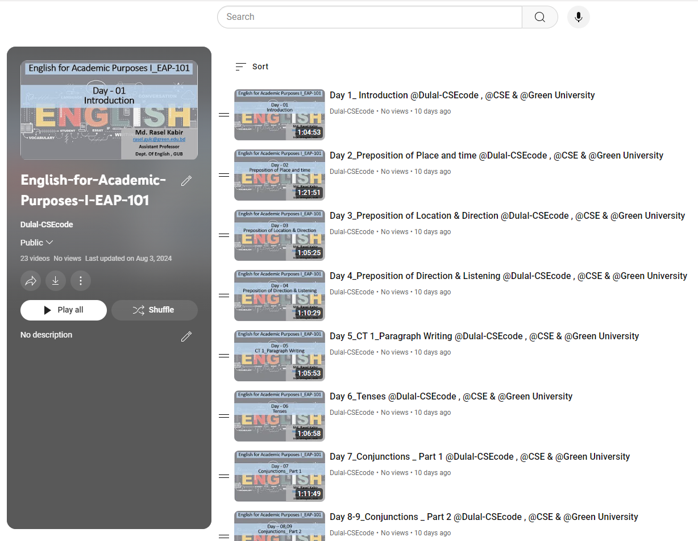

<h1 align="center">--- English-for-Academic-Purposes-I-EAP-101 ---</h1>  
<h3 align="center">-- Spring 2022 --</h3>  
<br />  
Welcome to the English for Academic Purposes I (EAP-101) repository. This repository contains course materials, assignments, and resources for the English for Academic Purposes course.  
<br />  



  
<br />  

## Table of Contents
- [Introduction](#introduction)
- [Course Outline](#course-outline)
- [Installation](#installation)
- [Prerequisites](#prerequisites)
- [Assignments and Practice Problems](#assignments-and-practice-problems)
- [Usage](#usage)
- [Contributing](#contributing)
- [License](#license)

## Introduction

In this course, we will focus on developing the necessary academic language skills for effective communication in an academic environment. Topics include reading comprehension, academic writing, listening, and speaking. The repository provides comprehensive materials to help you improve your proficiency in these areas.

Check out the playlist now and start your learning journey: [Youtube Playlist Link](https://youtube.com/playlist?list=PLEc-WcPXUsjsm4_JTG3Pvc7wgva-cx3yQ&si=gipLEXV_A_A8tfdd)  
**Happy Learning!**

## Course Outline  //  Day Contents

### Day 1
1. Introduction to Course

### Day 2
1. Nouns – 1
2. Situational speaking using Nouns
3. Assigning Homework

### Day 3
1. Nouns – 2
2. Feedback on Homework

### Day 4
1. Review on Nouns
2. Listening Practice – 1
3. Assign CT 01 on Nouns

### Day 5
1. CT 01
2. Capitalization
3. Assign Homework

### Day 6
1. Review on Capitalization
2. Listening Practice – 2

### Day 7
1. Tenses – 1
2. Listening Practice – 3

### Day 8
1. Tenses – 2
2. Demo Listening Test

### Day 9
1. Listening Test
2. Turnitin Guidelines for Assignment Submission
3. Assign CT – 02

### Day 10
1. CT – 02
2. Reading Skills – 1

### Day 11
1. Reading Skills – 2

### Day 12
1. Review
2. Question Pattern of Mid Assessment

### MIDTERM

### Day 13
1. Adjectives – 1
2. Speaking Practice
3. Assign Homework

### Day 14
1. Adjectives – 2
2. Class Assignment Guidelines

### Day 15
1. Adverbs
2. Writing Practice on Adjectives and Adverbs

### Day 16
1. Word Building
2. Assign CT 03

### Day 17
1. CT – 03
2. Presentation Skills – 1

### Day 18
1. Presentation Skills – 2
2. Pre-Writing Tasks – 1

### Day 19
1. Pre-Writing Tasks – 2
2. Practice Pre-Writing Tasks

### Day 20
1. Review on Pre-Writing Tasks
2. Reading Practice – 1

### Day 21
1. Reading Practice – 2
2. Speaking Practice

### Day 22
1. Review – 1
2. Viva Voce Guidelines – 1

### Day 23
1. Review – 2
2. Viva Voce Guidelines – 2

### Day 24
1. Question Pattern of Viva Voce

### FINAL EXAM

## Installation

To set up the environment:

1. Clone the repository:
   ```bash
   git clone https://github.com/Dulal-CSEcode/Structured-programming-CSE-103.git
   cd Structured-programming-CSE-103
    ```

2. Install any required packages or dependencies. For example, on a Debian-based system:

    ```bash
    sudo apt-get update
    sudo apt-get install build-essential
    ```
## Prerequisites

Before you begin, ensure you have met the following requirements:

- You have a basic understanding of programming concepts.
- You have access to a C/C++ compiler.
- You have a basic understanding of C/C++ programming.
- You have Git installed on your computer.

## Assignments and Practice Problems

This repository includes a collection of assignments and practice problems to help reinforce the concepts taught in the course. Each assignment is located in its respective directory with detailed instructions and resources.

## Usage
Navigate to the specific assignment or practice problem directory and follow the instructions provided in the README.md file located in each folder.

## Contributing
Contributions are welcome! To contribute, please follow these steps:

1. Fork the repository.

2. Create a new branch (e.g., feature-branch).

3. Make your changes and commit them (git commit -m 'Add new feature').

4. Push to the branch (git push origin feature-branch).

5. Create a pull request.

Please ensure your code follows the repository's coding standards and includes appropriate tests.

## License
This project is licensed under the MIT License. See the LICENSE file for more details.

<br/>
<h2 align="center">Thanks for visiting the English-for-Academic-Purposes-I-EAP-101 repository.</h2>
<h3 align="center">© All rights reserved by Dulal-CSEcode @2024 © Department of Computer Science and Engineering, GUB</h3>
